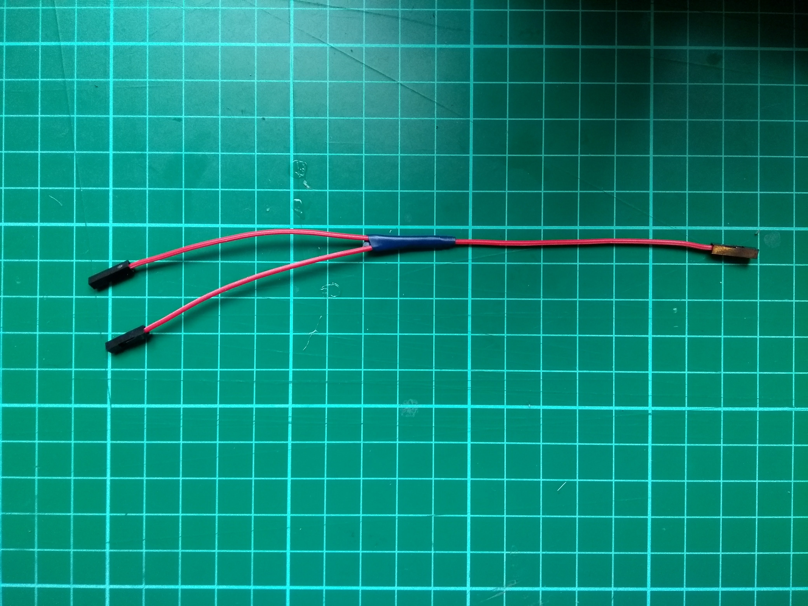

## تجهيز الموصلات

ستكون خطوتك الأولى توصيل حساسات خطك بالعربات التي تجرها الدواب. عادة، نوع حساس الخط المستخدم في هذا المشروع يحتاج إلى أن يكون متصلا بـ **3V3** pin، لكنك ستقوم بتشغيل حساسين عبر نفس دبوس الطاقة لذلك سوف ترفق كليهما بـ **5V** pin.

أولاً ، ستقوم بإعداد الأسلاك الخاصه بك!

--- task ---

- خذ ثلاثة من أسلاك التوصيل من نوع (أنثى - أنثى) ، وقم بإزالة موصل من كل طرف ، ثم قم بفك الغلاف البلاستيكي لأظهار حوالي سنتيمتر واحد من السلك متعدد النواة تحته.

--- /task ---

--- task ---

- خذ أسلاك التوصيل الثلاثة وقم بلف أسلاكها متعددة النواة معًا. ثم استخدم مكواة لحام لربط خيوط الرصاص للأسلاك.

--- /task ---

--- task ---

قم بتغطية الخيوط الموصلة بكمية صغيرة من الشريط العازل.

--- /task ---

--- task ---

كرر العملية بأكملها مع ثلاث أسلاك توصيل أخرى من نوع (أنثى-أنثى).

--- /task ---