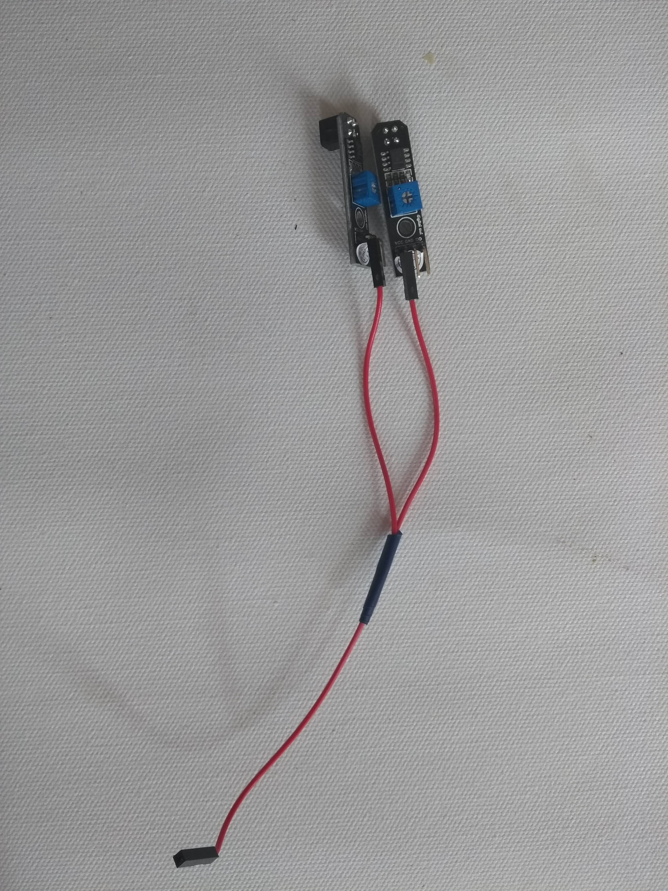

## Σύνδεσε τους αισθητήρες γραμμής

Κάθε αισθητήρας γραμμής έχει τρια pins: **VCC** για ρεύμα, **GND** για τη γείωση και **DO** για ψηφιακή έξοδο.

\--- task \--- Πάρε έναν από τους συγκολλημένους αγωγούς σου και σύνδεσε τα δύο άκρα του με το **VCC** ακροδέκτη σε κάθε έναν από τους δύο αισθητήρες.

 \--- /task \---

\--- task \--- Πάρε τον δεύτερο από τους συγκολλημένους αγωγούς σου και σύνδεσε τα δύο άκρα του με το **GND** ακροδέκτη σε κάθε έναν από τους δύο αισθητήρες.  \--- /task \---

\--- task \--- Πάρε τα υπόλοιπα δυο μονά καλώδια και σύνδεσε το καθένα στο **DO** pin σε κάθε αισθητήρα γραμμής.  \--- /task \---

\--- task \--- Σύνδεσε τώρα τους **VCC** ακροδέκτες και των δύο αισθητήρων γραμμής στο **5V** pin στο Raspberry Pi σου, και τους **GND** ακροδέκτες των αισθητήρων στο **GND** pin του Raspberry Pi. Κάθε ένα από τα δύο **DO** pins μπορούν να συνδεθούν με οποιοδήποτε αριθμημένο GPIO pin. Σε αυτό το παράδειγμα, χρησιμοποιούνται τα pin **GPIO 17** και **GPIO 27**.  \--- /task \---