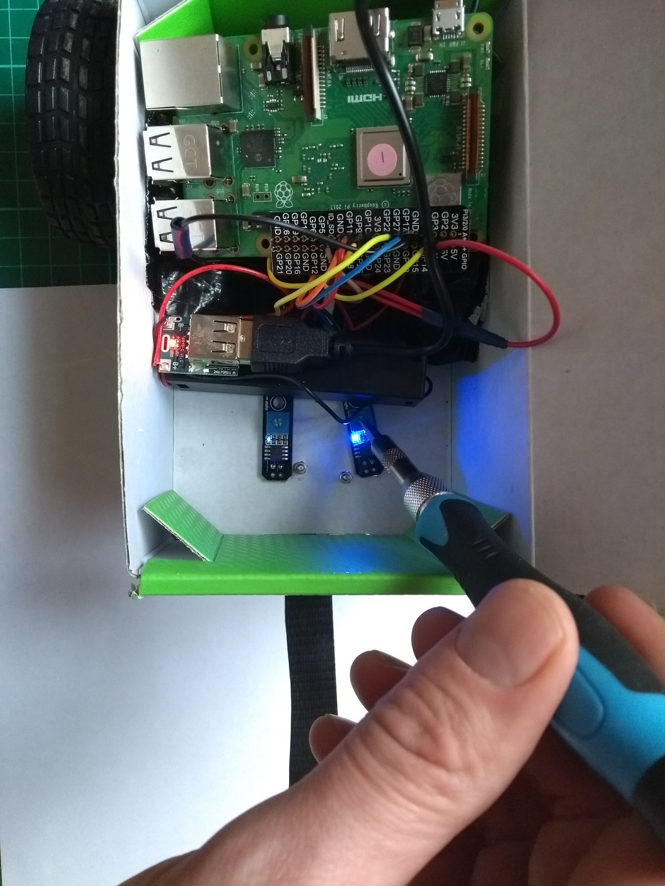

## Έλεγξε τους αισθητήρες γραμμής

Στη συνέχεια θα ελέγξεις αν οι αισθητήρες γραμμής σου λειτουργούν και θα τους ρυθμίσεις.

\--- task \---

With the line sensor attached, boot up your Raspberry Pi.

\--- /task \---

\--- task \---

Cut two small holes in the bottom of your buggy so that the sensor can view the line beneath it, and secure your sensors in place.

\--- /task \---

When the sensors pass over a dark line, the LED on the sensor board should turn off.

\--- task \---

Use the small potentiometer on the board to tune your sensors, so that the LEDs turns off when over a dark line, and lights up when over white space.

\--- /task \---

Once you have tuned the sensors, you can proceed to programming your robot.