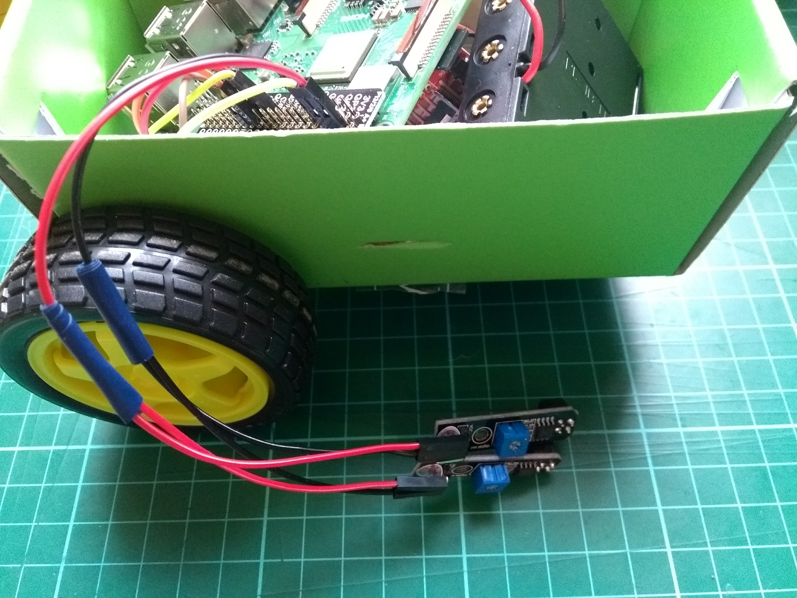

## Connect the line sensors

Each line sensor has three pins: **VCC** for power, **GND** for ground, and **DO** for digital out.

--- task ---

Take one of your soldered-together three-wire jumper leads, and connect two of its ends to the **VCC** pin on each of the two sensors.

--- /task ---

--- task ---

Take the second of your soldered jumper leads, and connect two ends to the **GND** pin on each line sensor.

--- /task ---

--- task ---

Take your remaining two single jumper leads and connect each one to the **DO** pin on each line sensors.

--- /task ---

--- task ---

Now connect the **VCC** pins of both line sensors to a **5V** pin on your Raspberry Pi, and the **GND** pins of the sensors to a **GND** pin on your Raspberry Pi. Each of the two **DO** pins can be connected to any numbered GPIO pin. In this example, pins **GPIO 17** and **GPIO 27** are used.

--- /task ---
