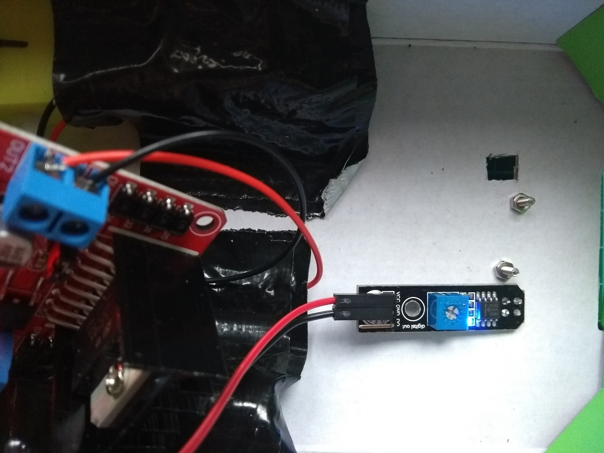

# Test the lines sensors

Next you're going to test that your line sensors are working and tune them a little.

--- task ---
Cut two small holes in the bottom of your buggy, so that the sensor can view the line beneath it, and secure your sensors in place.

--- /task ---

When the sensors pass over a dark line, the LED on the sensor board should turn off.

--- task ---
Use the small potentiometer on the board, to tune your sensors, so that the LEDs turns off when over a dark line, and lights up when over whitespace.

--- /task ---

Once you have tuned the sensors, you can proceed to programming your robot.
