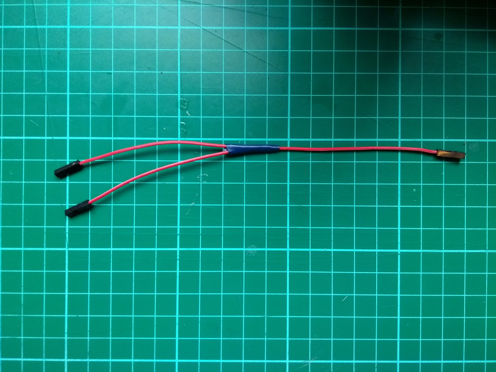

## Préparer les connecteurs

Ta première étape sera de connecter tes capteurs de ligne à ton buggy. Normalement, le type de capteur de ligne utilisé dans ce projet doit être connecté à une broche **3V3**, mais tu vas faire fonctionner deux capteurs via la même broche d'alimentation, donc tu les attacheras tous les deux à une broche **5V**.

Tout d'abord, tu vas préparer tes fils !

--- task---

- Prends trois de tes fils de cavalier femelle à femelle, retire un connecteur de chaque extrémité, puis dénude la gaine en plastique pour révéler environ un centimètre du fil multibrins en dessous.

--- /task ---

--- task ---

- Prends les trois fils de cavalier et torsade leurs fils multibrins ensemble. Ensuite, utilise un fer à souder pour relier les fils.

--- /task ---

--- task ---

Couvre la jonction des fils avec une petite quantité de ruban isolant.

--- /task ---

--- task ---

Répète tout le processus avec trois autres fils de cavalier femelle à femelle.

--- /task ---