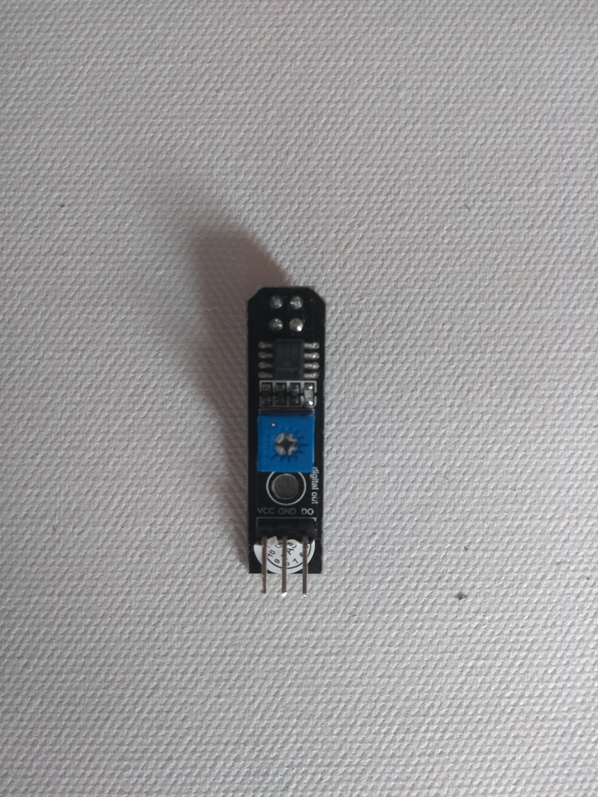
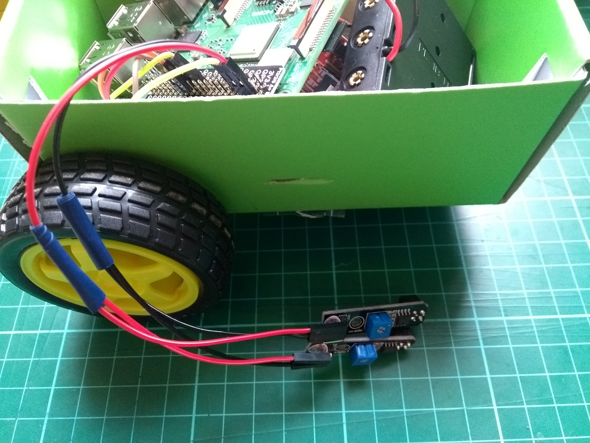

## लाइन सेंसर जोड़े

प्रत्येक लाइन सेंसर में तीन पिन होते हैं: **VCC** विधुत शक्ति के लिए, **GND** जमीन के लिए, और **DO** डिजिटल आउट के लिए।

--- task ---

आपकी एकसाथ-सोल्डर की गई तीन-वायर जम्पर लीडो, में से एक लें, और इसके दो अंतिम छोरों को प्रत्येक दोनों सेंसरों पर **VCC** पिन से जोड़े ।

--- /task ---

--- task ---

आपकी सोल्डर जम्पर लीड्स के दूसरे लीड को लें, और दो छोरों को प्रत्येक लाइन सेंसर पर **GND** पिन से जोड़े ।

--- /task ---

--- task ---

आपकी शेष दो एकल जम्पर ले जाएं और प्रत्येक को प्रत्येक लाइन सेंसर पर **DO** पिन से जोड़े।

--- /task ---

--- task ---

अब दोनों लाइन सेंसर के **VCC** पिनों को अपने Raspberry Pi के **5V** पिन से जोड़े, और सेंसर के **GND** पिनों को अपने Raspberry Pi के **GND** पिन से जोड़े । दोनों में से प्रत्येक **DO** पिन को किसी भी गिने हुए GPIO पिन से जोड़ा जा सकता है। इस उदाहरण में, पिन **GPIO 17** और **GPIO 27** उपयोग किया गया है।

--- /task ---