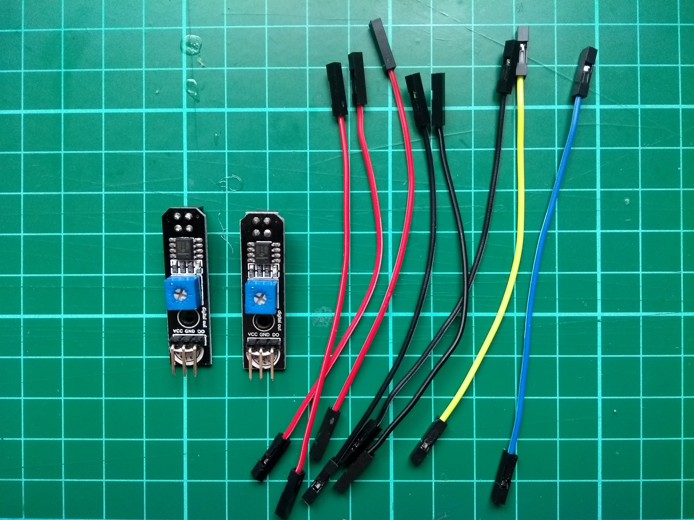

## ಪರಿಚಯ

ಈ ಸಂಪನ್ಮೂಲದಲ್ಲಿ, ನಿಮ್ಮ ರೋಬೋಟ್ Buggy ಯನ್ನು ನೀವು ಲೈನ್-ಫಾಲೋಯಿಂಗ್ ರೋಬೋಟ್ Buggy ಯಾಗಿ ಪರಿವರ್ತಿಸುವಿರಿ. ಇದು ಟ್ರ್ಯಾಕ್‌ನ ಸುತ್ತಲೂ ಸುಲಭವಾಗಿ ಚಲಿಸಬಹುದು. ಈ ಪ್ರಾಜೆಕ್ಟ್ ಅನ್ನು ಪ್ರಯತ್ನಿಸುವ ಮುನ್ನ, ನಿಮ್ಮ ಬಳಿ ಕೆಲಸ ಮಾಡುವ Buggy ಇರಬೇಕು ಅಥವಾ ಈಗಾಗಲೇ [Build a Buggy](https://projects.raspberrypi.org/en/projects/build-a-buggy) ಸಂಪನ್ಮೂಲವನ್ನು ಪೂರ್ಣಗೊಳಿಸಿರಬೇಕು.

<stream class="cloudflare-video" id="6a20279dbfe23651cfe17ebe616b87b7" loop></stream>

## \--- collapse \---

title: ನಿಮಗೆ ಬೇಕಾದುದು

## image: images/image

ನಿಮ್ಮ Raspberry Pi Buggy ಜೊತೆಗೆ, ನಿಮಗೆ ಇವುಗಳು ಬೇಕಾಗುತ್ತವೆ:

+ 8 ಫೀಮೇಲ್-ಟು-ಫೀಮೇಲ್ ಅಥವಾ ಫೀಮೇಲ್-ಟು-ಮೇಲ್ ಜಂಪರ್ ಲೀಡ್ ಗಳು
+ ಎರಡು ಲೈನ್ -ಅನುಸರಿಸುವ ಸೆನ್ಸರ್ ಗಳು
+ ಬೆಸುಗೆ ಹಾಕುವ ಕಬ್ಬಿಣ ಮತ್ತು ಬೆಸುಗೆ
+ ತೆರೆದ ವಿದ್ಯುತ್ತಂತಿಗಳನ್ನು ಮುಚ್ಚಲು ಬಲಸುವ ಟೇಪ್(ಇನ್ಸುಲೇಟಿಂಗ್ ಟೇಪ್)

ನೀವು ಈ ಪ್ರಾಜೆಕ್ಟ್ ಅಲ್ಲಿ ಉಪಯೋಗಿಸುವ ಲೈನ್-ಅನುಸರಿಸುವ ಸೆನ್ಸರ್ ಗಳನ್ನು [buggy shopping list](https://my.aliexpress.com/wishlist/wish_list_product_list.htm?spm=a2g0s.8937460.0.0.EKSrsx&currentGroupId=100000000943756){target="_blank"} ಇಂದ ನೀವು ಖರೀದಿಸಬಹುದು.ಅದಾಗ್ಯೂ,ಯಾವುದೇ ಲೈನ್ ಸೆನ್ಸರ್ ಗಳು ಕಾರ್ಯನಿರ್ವಹಿಸುತ್ತವೆ.

\--- /collapse \---

## \--- collapse \---

## title: ನೀವು ಏನು ಕಲಿಯುವಿರಿ

ಈ ಪ್ರಾಜೆಕ್ಟ್ ಈ ಕೆಳಗಿನ ಎಳೆಗಳಿಂದ [Raspberry Pi Digital Making Curriculum](http://rpf.io/curriculum){:target="_blank"}: ಅಂಶಗಳನ್ನು ಒಳಗೊಂಡಿದೆ:

+ [Apply abstraction and decomposition to solve more complex problems](https://curriculum.raspberrypi.org/programming/developer/){:target="_ blank"} (ಹೆಚ್ಚು ಸಂಕೀರ್ಣ ಸಮಸ್ಯೆಗಳನ್ನು ಪರಿಹರಿಸಲು ಅಬ್ಸ್ಟ್ರಾಕ್ಷನ್ ಮತ್ತು ಡಿಕಂಪೋಸಿಷನ್ ಅನ್ವಯಿಸಿ)
+ [Process input data to monitor or react to the environment](https://curriculum.raspberrypi.org/physical-computing/developer/){:target="_ blank"} (ಪರಿಸರವನ್ನು ಮೇಲ್ವಿಚಾರಣೆ ಮಾಡಲು ಅಥವಾ ಪ್ರತಿಕ್ರಿಯಿಸಲು ಇನ್ಪುಟ್ ಡೇಟಾವನ್ನು ಪ್ರಕ್ರಿಯೆಗೊಳಿಸಿ)
+ [ಪ್ರಾಜೆಕ್ಟ್ ಮೂಲಮಾದರಿಗಳನ್ನು ರಚಿಸಲು ಮೂಲ ವಸ್ತುಗಳು ಮತ್ತು ಸಾಧನಗಳನ್ನು ಬಳಸಿ](https://curriculum.raspberrypi.org/manufacture/creator/){:target="_ blank"}

\--- /collapse \---

## \--- collapse \---

## title: ಶಿಕ್ಷಕರಿಗೆ ಹೆಚ್ಚುವರಿ ಮಾಹಿತಿ

ನೀವು ಈ ಪ್ರಾಜೆಕ್ಟನ್ನು ಮುದ್ರಿಸಬೇಕಾದರೆ, ದಯವಿಟ್ಟು [ಮುದ್ರಕ-ಸ್ನೇಹಿ ಆವೃತ್ತಿಯನ್ನು ಬಳಸಿ](https://projects.raspberrypi.org/en/projects/rpi-python-line-following/print){:target="_blank"}.

Footer ನಲ್ಲಿ ಇರುವ link ಇಂದ GitHub repository ಅನ್ನು ಈ ಪ್ರಾಜೆಕ್ಟ್ ಗಾಗಿ ಬಳಸಿ. ಅದರ 'en/resources' ಫೋಲ್ಡರ್‌ನಲ್ಲಿ ಎಲ್ಲಾ ಸಂಪನ್ಮೂಲಗಳು ಇದೆ (ಮುಗಿದಿರುವ ಉದಾಹರಣೆ ಪ್ರಾಜೆಕ್ಟ್ ಕೂಡ ಸೇರಿದೆ).

\--- /collapse \---