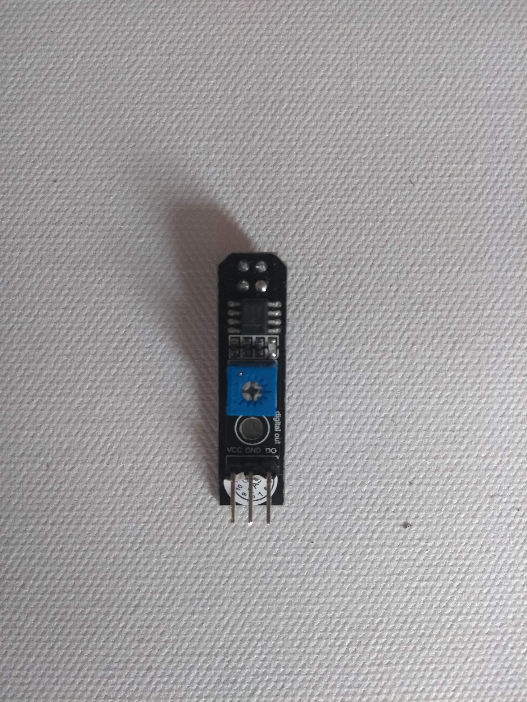

## ಲೈನ್ ಸೆನ್ಸರ್‌ಗಳನ್ನು ಕನೆಕ್ಟ್ ಮಾಡಿ

ಪ್ರತಿಯೊಂದು ಲೈನ್ ಸೆನ್ಸರ್ ಗೆ ಮೂರು pin ಗಳು ಇರುತ್ತವೆ: **VCC** ಪವರ್ ಗಾಗಿ, **GND** ಗ್ರೌಂಡ್ ಗಾಗಿ ಮತ್ತು**DO** ಡಿಜಿಟಲ್ ಔಟ್ ಗಾಗಿ.

\--- task \---

ಬೆಸುಗೆ ಹಾಕಿದ ಮೂರು-ತಂತಿಯ ಜಂಪರ್ಲೀ ಡ್ಸ್ ಗಳಲ್ಲಿ ಒಂದನ್ನು ತೆಗೆದುಕೊಂಡು, ಅದರ ಎರಡು ತುದಿಗಳನ್ನು ಪ್ರತಿ ಸೆನ್ಸರ್ ನ ** VCC ** pin ಗೆ ಕನೆಕ್ಟ್ ಮಾಡಿ.

\--- /task \---

\--- task \---

ಬೆಸುಗೆ ಹಾಕಿದ ಜಂಪರ್ ಲೀಡ್‌ಗಳಲ್ಲಿ ಎರಡನೆಯದನ್ನು ತೆಗೆದುಕೊಂಡು, ಎರಡು ತುದಿಗಳನ್ನು ಪ್ರತಿ ಸೆನ್ಸರ್ ನ **GND** pin ಗೆ ಕನೆಕ್ಟ್ ಮಾಡಿ.

\--- /task \---

\--- task \---

ಉಳಿದ ಎರಡು ಸಿಂಗಲ್ ಜಂಪರ್ ಲೀಡ್‌ಗಳನ್ನು ತೆಗೆದುಕೊಂಡು, ಪ್ರತಿಯೊಂದನ್ನು ಪ್ರತಿ ಸೆನ್ಸರ್ ನ **DO** pin ಗೆ ಕನೆಕ್ಟ್ ಮಾಡಿ.

\--- /task \---

\--- task \---

ಈಗ ಎರಡು ಲೈನ್ ಸೆನ್ಸರ್ ನ **VCC** pin ಗಳನ್ನು Raspberry Pi ನ **5V** pin ಗೆ ಕನೆಕ್ಟ್ ಮಾಡಿ ಮತ್ತು ಎರಡು ಲೈನ್ ಸೆನ್ಸರ್ ನ **GND** pin ಗಳನ್ನು Raspberry Pi ನ **GND** pin ಗೆ ಕನೆಕ್ಟ್ ಮಾಡಿ. ಎರಡು **DO** pin ಗಳನ್ನು ಯಾವುದೇ ಸಂಖ್ಯೆಯ GPIO pin ಗೆ ಕನೆಕ್ಟ್ ಮಾಡಬಹುದು. ಈ ಉದಾಹರಣೆಯಲ್ಲಿ, **GPIO 17** ಮತ್ತು **GPIO 27** pins ಗಳನ್ನು ಬಳಸಲಾಗಿದೆ.

\--- /task \---