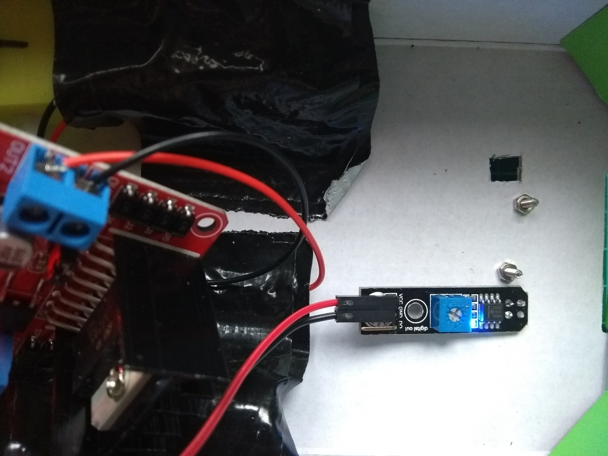

## लाईन्स सेन्सरची चाचणी घ्या

पुढे आपण आपले लाईन सेन्सर्स कार्यरत आहेत की नाही याची चाचणी घेणार आहात आणि आपण त्यांना थोडे ट्यून कराल.

--- task ---

लाइन सेन्सर जोडल्यामुळे, आपला Raspberry Pi बूट करा.

--- /task ---

--- task ---

आपल्या बग्गीच्या तळाशी दोन लहान छिद्रे कापून घ्या जेणेकरून सेन्सर त्याच्या खाली असलेली लाईन पाहू शकेल आणि आपले सेन्सर त्या जागी व्यवस्थित ठेवा.

--- /task ---

जेव्हा सेन्सर्स गडद रेषेतून जातात तेव्हा सेन्सर बोर्डवरील LED बंद करावा.

--- task ---

आपल्या सेन्सर्सला ट्यून करण्यासाठी फळावरील लहान पोटॅटीओमीटर वापरा, जेणेकरून गडद रेषा ओलांडून LED बंद होतील आणि पांढर्‍या जागेवर प्रकाश पडेल.

--- /task ---

एकदा आपण सेन्सर ट्यून केल्यावर आपण आपल्या रोबोट प्रोग्रामिंगकडे जाऊ शकता.