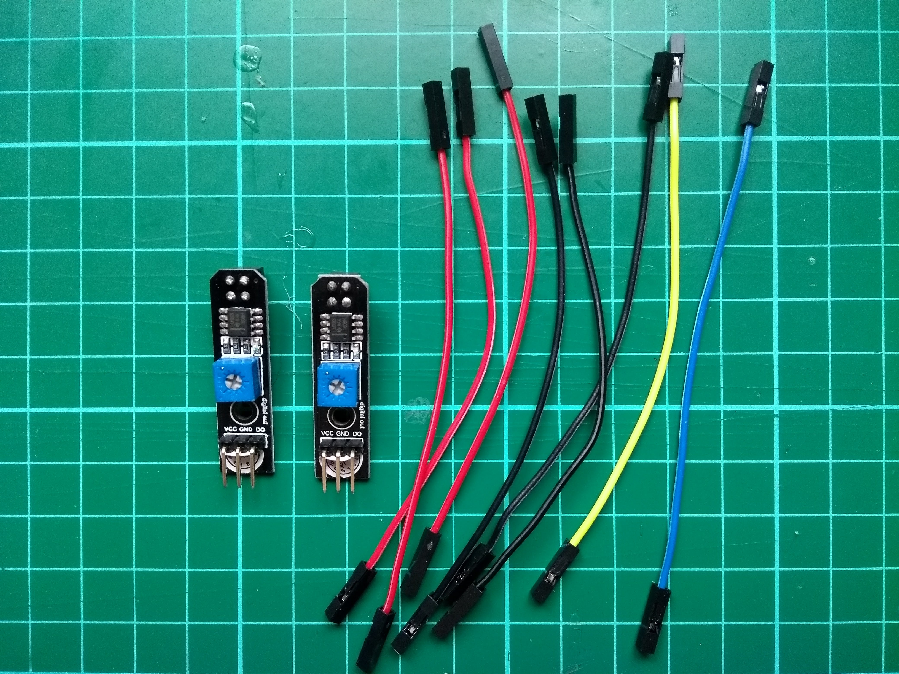

## Inleiding

In deze bron maak je van je robotbuggy een lijnvolgende robotbuggy, zodat het met gemak over een baan kan snorren. Zorg ervoor dat je de [Bouw een buggy](https://projects.raspberrypi.org/en/projects/build-a-buggy) bron al hebt voltooid of dat je een werkende buggy hebt voordat je dit project probeert.

<stream class="cloudflare-video" id="6a20279dbfe23651cfe17ebe616b87b7" loop></stream>

## \--- collapse \---

title: Wat heb je nodig

## image: images/image

Naast je Raspberry Pi-buggy heb je het volgende nodig:

+ 8 verbindingsdraden tussen vrouw en vrouw of tussen vrouw en man
+ 2 lijnvolg-sensoren
+ Soldeerbout en soldeer
+ Isolatietape

Je kunt de lijnvolg-sensoren die in dit project worden gebruikt kopen via deze [buggy shopping list](https://my.aliexpress.com/wishlist/wish_list_product_list.htm?spm=a2g0s.8937460.0.0.EKSrsx&currentGroupId=100000000943756){:target="_blank"}, hoewel alle lijnsensoren hier werken.

\--- /collapse \---

## \--- collapse \---

## title: Wat ga je leren

Dit project behandelt elementen uit de volgende onderdelen van het [Raspberry Pi Digital Making Curriculum](http://rpf.io/curriculum){:target="_blank"}:

+ [Pas abstractie en decompositie toe om complexere problemen op te lossen](https://curriculum.raspberrypi.org/programming/developer/){:target="_blank"}
+ [Verwerk invoergegevens om de omgeving te bewaken of erop te reageren](https://curriculum.raspberrypi.org/physical-computing/developer/){:target="_blank"}
+ [Gebruik basismaterialen en hulpmiddelen om projectprototypes te maken](https://curriculum.raspberrypi.org/manufacture/creator/){:target="_blank"}

\--- /collapse \---

## \--- collapse \---

## title: Aanvullende informatie voor docenten

Als je dit project wilt afdrukken, gebruik dan de [printervriendelijke versie](https://projects.raspberrypi.org/en/projects/rpi-python-line-following/print){:target="_blank"}.

Gebruik de link in de voettekst voor toegang tot de GitHub repository voor dit project, met daarin alle bronnen (inclusief een voorbeeld van een voltooid project) in de map ' nl-NL/resources'.

\--- /collapse \---