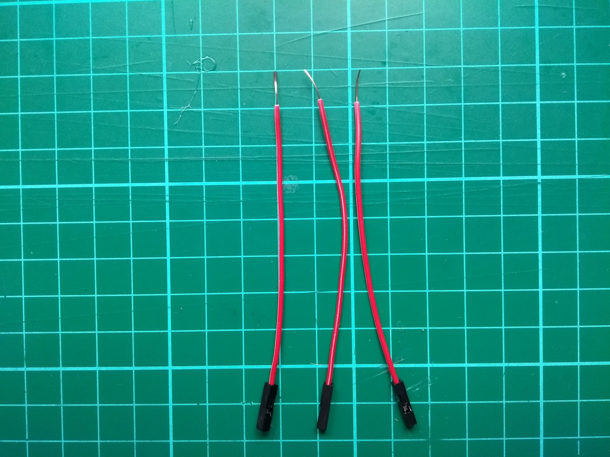
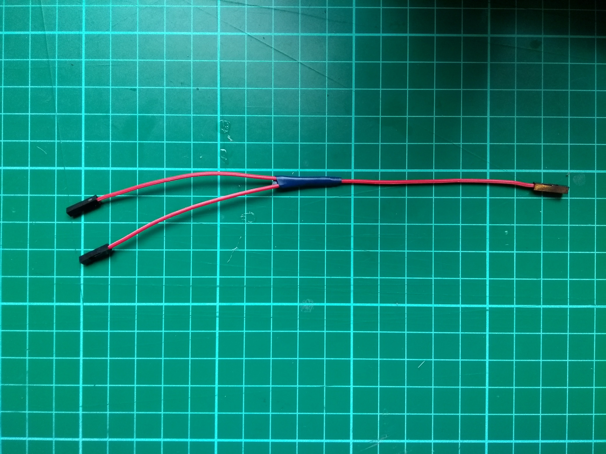

## Bereid de connectoren voor

Je eerste stap is het verbinden van je lijnsensoren met je buggy. Normaal gesproken moet het type lijnsensor dat in dit project wordt gebruikt worden aangesloten op een **3V3** pin, maar je gaat twee sensoren uitvoeren via dezelfde voedingspen, zodat je ze allebei vastmaakt aan een **5V** pin.

Ten eerste ga je je draden voorbereiden!

\--- task\---

- Neem drie van je vrouw-naar-vrouw verbindingsdraden, verwijder een connector van elk uiteinde en strip vervolgens de plastic huls om ongeveer een centimeter van de meeraderige draad eronder te onthullen.

\--- /task \---

\--- task \---

- Pak de drie verbindingsdraden en draai de multicore-draden samen. Gebruik vervolgens een soldeerbout om de draden te verbinden.

\--- /task \---

\--- task \---

Bedek de verbinding van de draden met een kleine hoeveelheid isolatieband.

\--- /task \---

\--- task \---

Herhaal het hele proces met nog eens drie vrouw-naar-vrouw verbindingsdraden.

\--- /task \---