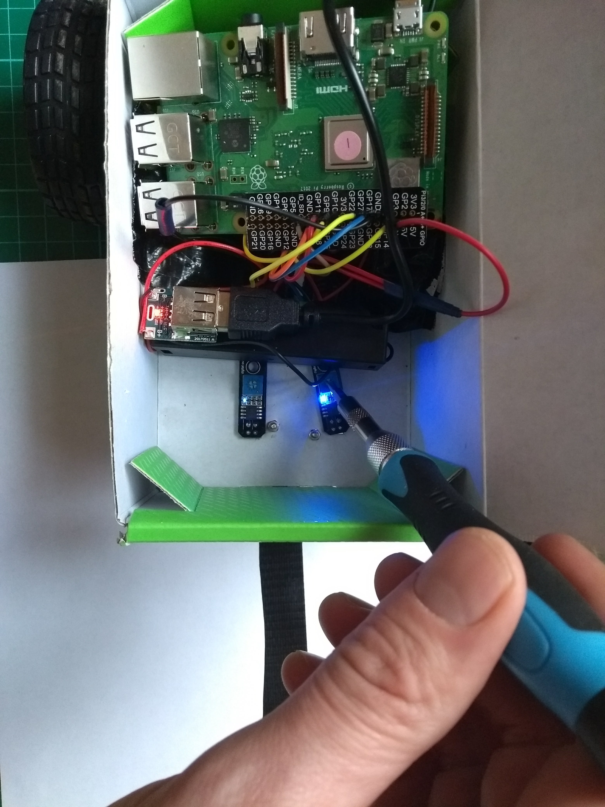

## Test de lijnsensoren

Vervolgens ga je testen of je lijnsensoren werken, en je zult ze een beetje afstellen.

--- task ---

Start de Raspberry Pi op met de lijnsensor aangesloten.

--- /task ---

--- task ---

Knip twee kleine gaten in de onderkant van je buggy zodat de sensor de lijn eronder kan zien en zet je sensoren vast.

--- /task ---

Wanneer de sensoren een donkere lijn passeren, moet de LED op de sensorkaart uit gaan.

--- task ---

Gebruik de kleine potentiometer op het bord om je sensoren af te stellen, zodat de LED's boven een donkere lijn uit gaan en boven een witte ruimte gaan branden.

--- /task ---

Nadat je de sensoren hebt afgesteld, kun je doorgaan met het programmeren van je robot.